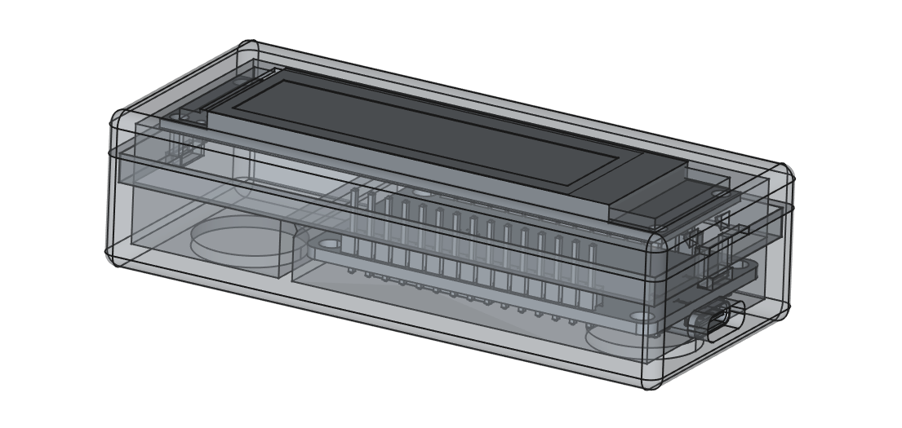

# Train Times Departure Board

A project to display live UK train departure board information for a specific station and destination, both on a Python terminal and on an ESP32-powered OLED hardware display.



## Features

- Fetches live train departure data from the [raildata.org.uk](https://raildata.org.uk/) API.
- Python script for terminal-based display with scrolling and blinking for delays/cancellations.
- ESP32 firmware for displaying departures on an SH1122 256x64 OLED using PlatformIO and Arduino.
- Customizable station and destination via config file.

---

## Quick Start
If you just want to try it out locally on your computer, you can use the Python terminal display (see section 1 below). If you want to run it on the ESP32-powered TrainTimes device, see section 2 for the ESP32 firmware.

### 1. Python Terminal Display

1. **Install dependencies**  
    ```sh
    pip install -r requirements.txt
    ```

2. **Configure your API key and station**  
    Edit the `config` file to set your API key, station code, and destination CRS code:
    ```ini
    [DEFAULT]
    API_KEY = 'your_api_key'
    STATION_CODE = 'HDM'
    DEST_CRS = 'MYB'
    ```

3. **Run the script**
    ```sh
    python python_model.py
    ```

This will display a live departure board in your terminal.

---

### 2. ESP32 Firmware

The main firmware is in the [`firmware/`](firmware/) directory.

#### Requirements

- [PlatformIO](https://platformio.org/) (VSCode extension recommended)
- ESP32 Dev Board
- SH1122 256x64 OLED display (4-wire SPI)

#### Setup

1. Copy your WiFi credentials and API key into `firmware/include/secrets.h`:
     ```cpp
     // secrets.h
     const char* ssid = "YOUR_WIFI_SSID";
     const char* password = "YOUR_WIFI_PASSWORD";
     const char* apiKey = "YOUR_API_KEY";
     ```
2. Connect the OLED display to the ESP32 as per the pin mapping in [`DepartureBoardDisplay.cpp`](firmware/lib/DepartureBoardDisplay/DepartureBoardDisplay.cpp).

#### Build & Upload

From the `firmware/` directory:
```sh
pio run -t upload
```
Or use the PlatformIO VSCode extension.

---


## CAD

3D models for the enclosure and components are in the [`cad/`](cad/) directory.

---

## Contributing

Contributions to improve the project via GitHub Pull Requests are welcomed. The directory structure is as follows:

```
.
├── config
├── python_model.py
├── requirements.txt
├── cad/
│   └── [3D models and exports for enclosure]
└── firmware/
     ├── platformio.ini
     ├── src/
     │   └── main.cpp
     ├── lib/
     │   └── DepartureBoardDisplay/
     └── include/
```


## License


## Credits

- Uses [raildata.org.uk](https://raildata.org.uk/) for live train data.
- Uses [ArduinoJson](https://arduinojson.org/) and [U8g2](https://github.com/olikraus/u8g2) libraries for ESP32 firmware.

---
